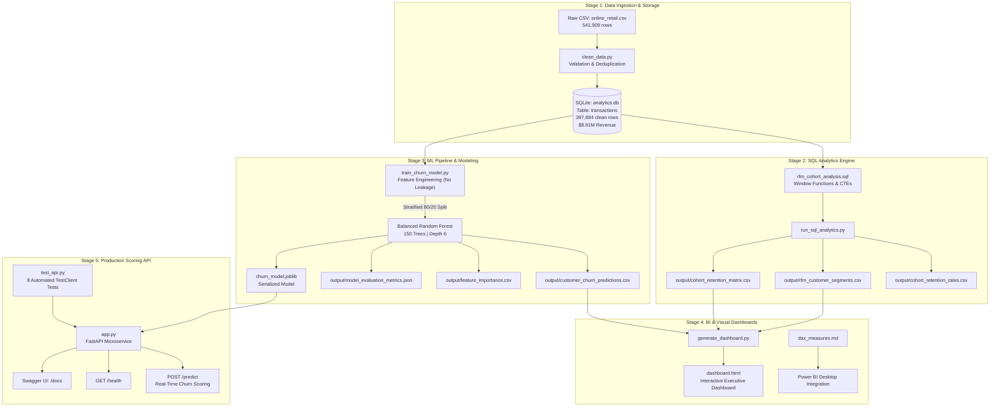

# End-to-End E-Commerce Customer Churn & Cohort Analytics System

[](https://www.python.org/)
[](https://fastapi.tiangolo.com/)
[](https://www.sqlite.org/)
[](https://scikit-learn.org/)
[](https://www.uvicorn.org/)
[](https://powerbi.microsoft.com/)
[](LICENSE)

An enterprise-grade, full-lifecycle customer analytics, cohort retention, and machine learning system built on the **Online Retail** transactional dataset (~541k records). 

This repository implements automated data ingestion, an embedded analytical data warehouse, high-performance SQL RFM customer segmentation, monthly retention cohort analysis, an interpretable and balanced Random Forest churn prediction model, a production-grade FastAPI real-time scoring microservice, and an interactive executive analytics dashboard.

---

## Table of Contents

1. [Executive Summary & Business Impact](#1-executive-summary--business-impact)
2. [End-to-End System Architecture](#2-end-to-end-system-architecture)
3. [Technology Stack & Architectural Rationale](#3-technology-stack--architectural-rationale)
4. [Project Directory Structure](#4-project-directory-structure)
5. [Step-by-Step Pipeline Deep Dive](#5-step-by-step-pipeline-deep-dive)
   - [Stage 1: Ingestion & Relational Data Warehouse](#stage-1-data-cleaning--ingestion-cleandatapy)
   - [Stage 2: SQL RFM Segmentation & Cohort Analysis](#stage-2-sql-rfm-segmentation--cohort-analysis-run_sql_analyticspy)
   - [Stage 3: Machine Learning Churn Prediction](#stage-3-machine-learning-churn-prediction-train_churn_modelpy)
   - [Stage 4: Executive Analytics Dashboard & Power BI](#stage-4-interactive-executive-dashboard-dashboardhtml)
   - [Stage 5: Real-Time FastAPI Scoring Microservice](#stage-5-production-ready-churn-scoring-api-apppy)
6. [Quickstart & Execution Guide](#6-quickstart--execution-guide)
7. [Automated Testing & Quality Assurance](#7-automated-testing--quality-assurance)
8. [License](#8-license)

---

## 1. Executive Summary & Business Impact

| Metric / KPI | Value | Business Interpretation |
| :--- | :--- | :--- |
| **Analyzed Raw Records** | **541,909** | Total unprocessed transaction line items from the online retailer. |
| **Validated Clean Transactions** | **397,884** (73.4%) | Valid sales retained after filtering returns, cancellations, and missing customer IDs. |
| **Total Captured Revenue** | **$8,911,407.90** | Lifetime revenue across 18,532 distinct customer orders. |
| **Unique Customer Accounts** | **4,338** | Tracked behavioral profiles across 37 global markets (dominant UK cohort). |
| **ML Model ROC-AUC** | **0.9558** | Near-optimal probabilistic separation between active customers and churners. |
| **Churn Recall (Sensitivity)** | **88.97%** | Successfully flags **258 out of 290** at-risk customers before churn occurs. |
| **Revenue at Immediate Risk** | **$1,135,452.58** | Value represented by the "At-Risk" segment (820 high-value customers). |
| **Champions Concentration** | **66.8% ($5.95M)** | 1,127 VIP customers generate two-thirds of total enterprise revenue. |

### Business Problem
Acquiring new e-commerce customers is **5x to 7x more expensive** than retaining existing ones. E-commerce platforms suffer from silent attrition: customers stop purchasing without formal notification or subscription cancellation. This project delivers a proactive retention engine that predicts churn **before** it happens and prescribes targeted marketing interventions based on individual churn probability and lifetime spend.

---

## 2. End-to-End System Architecture



---

## 3. Technology Stack & Architectural Rationale

| Category | Technology | Purpose in System | Architectural Rationale |
| :--- | :--- | :--- | :--- |
| **Language** | Python 3.11+ | Core orchestration, pipelines, ML, API | Industry standard for data science, ML libraries, and asynchronous web backends. |
| **Database** | SQLite 3.38+ | Embedded analytical warehouse (`analytics.db`) | Zero-configuration, serverless, atomic, and supports CTEs and window functions (`NTILE`). |
| **Data Processing** | Pandas, NumPy | Data cleaning, matrix pivoting, feature math | Fast vectorized columnar manipulations for tabular transactional datasets. |
| **Machine Learning** | Scikit-Learn | Tuned Random Forest, evaluation metrics | Highly interpretable, handles non-linearities, robust against multicollinearity, built-in feature importances. |
| **Model Persistence** | Joblib | Serialization (`churn_model.joblib`) | Optimized for saving NumPy arrays and tree-based estimators with minimal serialization overhead. |
| **REST API** | FastAPI | Real-time scoring microservice (`app.py`) | Async ASGI performance, auto-generated OpenAPI documentation (`/docs`), Pydantic validation. |
| **ASGI Server** | Uvicorn (Standard) | High-performance ASGI production server | Lightweight, event-loop driven concurrency for scalable HTTP request handling. |
| **Schema Validation** | Pydantic v2 | Data validation and fallback derivation | Robust type enforcement, automated error payloads (HTTP 422), and domain-specific feature derivation. |
| **QA / Testing** | Unittest & HTTPX | Pipeline and API test coverage | Validates database integrity, ML metric thresholds, and API endpoint contracts. |
| **Front-End / BI** | HTML5, CSS3, Power BI DAX | Visual executive dashboard & BI modeling | Zero-dependency executive dashboard viewable in any modern browser without extra servers. |

---

## 4. Project Directory Structure

```text
.
├── app.py                             # Stage 5: Production FastAPI service for real-time scoring
├── test_api.py                        # Automated unit & integration tests for FastAPI (8 tests)
├── requirements.txt                   # Pinned dependency definitions
├── online_retail.csv                  # Raw e-commerce transaction dataset (541k rows)
├── run_pipeline.py                    # Master End-to-End Pipeline Runner (Stages 1-4)
├── test_pipeline.py                   # Automated QA test suite for DB & ML model (4 tests)
├── clean_data.py                      # Stage 1: Data cleaning & SQLite ingestion
├── rfm_cohort_analysis.sql            # Stage 2: SQL RFM and Cohort views (CTEs + Window functions)
├── run_sql_analytics.py               # Stage 2: SQL execution & CSV export runner
├── train_churn_model.py               # Stage 3: ML feature extraction & model training
├── generate_dashboard.py              # Stage 4: Interactive HTML dashboard generator
├── dashboard.html                     # Standalone executive analytics dashboard
├── churn_model.joblib                 # Serialized Random Forest model artifact
├── dax_measures.md                    # Enterprise Power BI DAX library
├── analytics.db                       # Local SQLite database (indexed tables)
├── output/                            # Generated analytical and model artifacts
│   ├── rfm_customer_segments.csv      # Customer-level RFM scores & segments (4,338 records)
│   ├── cohort_retention_matrix.csv    # Monthly cohort active customer counts
│   ├── cohort_retention_rates.csv     # Monthly cohort retention rate percentages
│   ├── cohort_retention_details.csv   # Raw granular cohort metrics
│   ├── model_evaluation_metrics.json  # Accuracy, Precision, Recall, F1, ROC-AUC
│   ├── feature_importance.csv         # Ranked predictive feature weights
│   └── customer_churn_predictions.csv # Customer-level churn risk probabilities
└── README.md                          # Project documentation
```

---

## 5. Step-by-Step Pipeline Deep Dive

### Stage 1: Data Cleaning & Ingestion (`clean_data.py`)
- **Raw Ingestion**: Processes 541,909 raw records from `online_retail.csv`.
- **Cleaning Strategy**:
  1. **Identify Identifiable Accounts**: Drops 135,080 records with null `CustomerID`. In customer retention, transactions that cannot be attributed to an account cannot be modeled.
  2. **Eliminate Cancellations & Negatives**: Drops 8,945 records where `Quantity <= 0` (cancellations prefixed with 'C') or `UnitPrice <= 0` (system adjustments).
  3. **Feature Engineering**: Generates line revenue: `TotalAmount = Quantity * UnitPrice`.
- **Database Schema**: Generates `analytics.db` with SQLite B-tree indexes on `CustomerID`, `InvoiceDate`, and `InvoiceNo` to accelerate subsequent analytical joins and window aggregations.
- **Output**: 397,884 cleaned rows across 4,338 unique customers and $8,911,407.90 in revenue.

### Stage 2: SQL RFM Segmentation & Cohort Analysis (`run_sql_analytics.py`)
- **RFM Quintile Scoring**:
  - Uses SQLite CTEs and window function `NTILE(5)` over:
    - **Recency ($R$)**: Days since last transaction relative to dynamic snapshot.
    - **Frequency ($F$)**: Distinct invoice count.
    - **Monetary ($M$)**: Total spend.
  - Inverts Recency score ($5 - NTILE(5) + 1$) so that lower recency days yield higher loyalty scores.
- **8 Customer Behavioral Segments**:
  - **Champions (1,127 customers / 66.8% revenue)**: Average spend $5,279.29, recency 13.6 days.
  - **Loyal Customers (826 customers / 15.6% revenue)**: Average spend $1,685.28, recency 38.4 days.
  - **At-Risk (820 customers / 12.7% revenue)**: Average spend $1,384.70, recency 156.7 days ($1.13M revenue at risk).
  - **Churned (604 customers / 1.5% revenue)**: Average spend $226.58, recency 276.8 days.
  - **Potential Loyalists (308)**, **Hibernating (312)**, **Need Attention (192)**, **Promising (149)**.
- **Monthly Cohort Retention Analysis**:
  - Assigns each customer to an acquisition cohort based on their initial transaction month (`strftime('%Y-%m', MIN(InvoiceDate))`).
  - Computes `CohortIndex = (InvoiceYear - CohortYear)*12 + (InvoiceMonth - CohortMonth)`.
  - Pivots into active customer counts and percentage retention rates across Months 0 to 12.

### Stage 3: Machine Learning Churn Prediction (`train_churn_model.py`)
- **Target Variable Definition**: `Is_Churned = 1` if customer inactivity $> 90$ days, else `0`.
- **Feature Set (9 Features)**:
  - `Frequency`, `Monetary`, `AvgOrderValue`, `TotalUnits`, `AvgBasketSize`, `DistinctProducts`, `CustomerTenure`, `PurchaseVelocity`, `Is_UK`.
- **Model Training**:
  - Random Forest Classifier (150 trees, max depth 6, min samples leaf 3, `class_weight="balanced"`).
  - Stratified 80/20 train/test split.
- **Evaluation Metrics (Test Set - 868 customers)**:
  - **ROC-AUC**: **0.9558**
  - **Recall**: **88.97%** (Identifies 258 out of 290 actual churners)
  - **Precision**: **75.22%**
  - **F1-Score**: **0.8152**
  - **Accuracy**: **86.52%**
- **Confusion Matrix**:
  ```text
                    Predicted Active (0)    Predicted Churned (1)
  Actual Active (0)         493 (TN)                 85 (FP)
  Actual Churned (1)         32 (FN)                258 (TP)
  ```
- **Feature Importance Rankings**:
  1. `PurchaseVelocity`: **50.52%** (Dominant leading indicator)
  2. `CustomerTenure`: **19.66%**
  3. `Frequency`: **11.15%**
  4. `Monetary`: **6.85%**
  5. `TotalUnits`: **5.15%**
  6. `DistinctProducts`: **3.31%**
  7. `AvgOrderValue`: **1.85%**
  8. `AvgBasketSize`: **1.48%**
  9. `Is_UK`: **0.03%**

### Stage 4: Interactive Executive Dashboard (`dashboard.html`)
- Built using self-contained vanilla HTML/CSS/JS without external CDN dependencies.
- Features:
  - Executive KPI summary cards (Total Revenue, Active Customers, Churn Rate %, High-Risk Count).
  - Visual Cohort Retention Heatmap matrix.
  - Customer segment distribution breakdown.
  - Recency vs. Frequency scatter charts with risk overlay.

### Stage 5: Production-Ready Churn Scoring API (`app.py`)
- **FastAPI Microservice**:
  - Real-time scoring endpoint at `POST /predict`.
  - Service health check at `GET /health`.
  - Interactive Swagger documentation at `/docs` and ReDoc at `/redoc`.
  - **Lifespan Manager**: Loads `churn_model.joblib` into memory upon server startup, avoiding per-request disk read latency.
  - **Resilient Fallback**: Accepts core metrics (`frequency`, `monetary`, `tenure`) and automatically computes derived features.
  - **Dynamic CRM Rule Engine**: Maps probability into operational risk tiers (`High Risk`, `Medium Risk`, `Low Risk`) and provides tailored marketing action text.
  - **Retention workflow**: `POST /upload` derives features from raw transactions, `GET /customers/{customer_id}` analyzes an individual customer, `POST /predict/bulk` scores a file, and `GET /priority` ranks retention candidates by model risk and customer value.
  - **Campaign simulation**: `POST /campaign/generate` records a `SIMULATED` action only; it does not call an external CRM or messaging provider.
  - **Configuration visibility**: `GET /` exposes the active 90-day churn rule, risk thresholds, and VIP monetary threshold used by the service.
    - **Operational controls**: normalized uploads persist in `uploads.db` and are restored at startup; request logs are emitted as JSON; `RATE_LIMIT_REQUESTS` and `RATE_LIMIT_WINDOW_SECONDS` configure per-client throttling; set `API_KEY` to require `X-API-Key` on protected routes.
    - **Model governance**: `GET /model/status` reports the serving artifact checksum, feature contract, and active thresholds.

---

## 6. Quickstart & Execution Guide

### Prerequisites
Clone the repository and install all dependencies:
```bash
pip install -r requirements.txt
```

### Option A: One-Click Master Pipeline
To execute all stages sequentially (data cleaning &rarr; SQL analytics &rarr; ML training &rarr; dashboard generation):
```bash
python run_pipeline.py
```
*Total execution time: $\approx 15\text{–}18$ seconds.*

### Option B: Run the FastAPI Real-Time Scoring Server
Launch the local Uvicorn development server with hot-reloading:
```bash
uvicorn app:app --reload
```
- **Service URL**: `http://127.0.0.1:8000`
- **Interactive Swagger Docs**: [http://localhost:8000/docs](http://localhost:8000/docs)
- **Alternative ReDoc UI**: [http://localhost:8000/redoc](http://localhost:8000/redoc)

#### Example API Request via cURL
```bash
curl -X POST "http://127.0.0.1:8000/predict" \
  -H "Content-Type: application/json" \
  -d '{
    "frequency": 4,
    "monetary": 1797.24,
    "tenure": 359
  }'
```

#### Example Response (HTTP 200)
```json
{
  "churn_probability": 0.4532,
  "risk_level": "Medium Risk",
  "recommended_action": "Proactive Retention & Nurture: Customer activity is decelerating. Trigger personalized email campaign with replenishment reminders, curated category recommendations, and double reward points on the next purchase.",
  "predicted_churn": 0
}
```

#### Raw Transaction Upload Workflow
```bash
curl -X POST "http://localhost:8000/upload" \
  -F "file=@transactions.csv"
```

After upload, open `http://localhost:8000/dashboard` to view the live retention priority queue. Uploads require `customer_id`, `order_date`, `amount`, and `quantity`; `order_id`, `product_id`, and `country` are optional and receive server-side defaults. Engineered model features are generated server-side.

### Option C: View the Executive Dashboard
Open [`dashboard.html`](dashboard.html) directly in any browser:
```powershell
start dashboard.html
```

### Option D: Run with Docker
Build and run the API without the local Python environment:
```bash
docker build -t ecommerce-churn-api .
docker run --rm -p 8000:8000 ecommerce-churn-api
```

Runtime controls are available through environment variables:
- `CORS_ORIGINS`: comma-separated allowed origins; defaults to `*` for local development.
- `MAX_UPLOAD_BYTES`: maximum CSV upload size; defaults to 25 MB.
- `CHURN_MODEL_VERSION`: model label stored with health responses and simulated campaigns.
- `API_KEY`: optional shared key for protected API routes; leave unset for local development.
- `RATE_LIMIT_REQUESTS`: requests permitted per client within the window; defaults to 120.
- `RATE_LIMIT_WINDOW_SECONDS`: rate-limit window; defaults to 60 seconds.

The health endpoint exposes the model version and SHA-256 checksum so deployments can verify which artifact is serving predictions. Campaign records remain explicitly `SIMULATED` and now retain that model version for auditability. Uploaded transactions persist in `uploads.db`, allowing customer analysis and the dashboard priority queue to survive an API restart.

---

## 7. Automated Testing & Quality Assurance

The project includes two automated test suites:

### 1. API Endpoint Test Suite (`test_api.py`)
Validates model loading, `/health` response schemas, risk-tier inference, automatic secondary feature derivation, raw upload handling, customer lookup, bulk scoring, retention prioritization, simulated campaigns, and HTTP 422 input validation guards:
```bash
python test_api.py -v
```
*Result: 14 API tests passing in the current suite.*

### 2. Database & ML Pipeline Test Suite (`test_pipeline.py`)
Validates SQLite database integrity (record counts, non-negativity), RFM CSV outputs, cohort retention rate logic (Month 0 = 100%), and model inference thresholds:
```bash
python test_pipeline.py -v
```
*Result: 4 pipeline tests passing in the current suite.*

## 8. License

This project is licensed under the MIT License.

### Continuous Integration
GitHub Actions runs Python compilation and both test suites on every push and pull request using [`.github/workflows/ci.yml`](.github/workflows/ci.yml).

---

## 10. License
This project is licensed under the MIT License.
